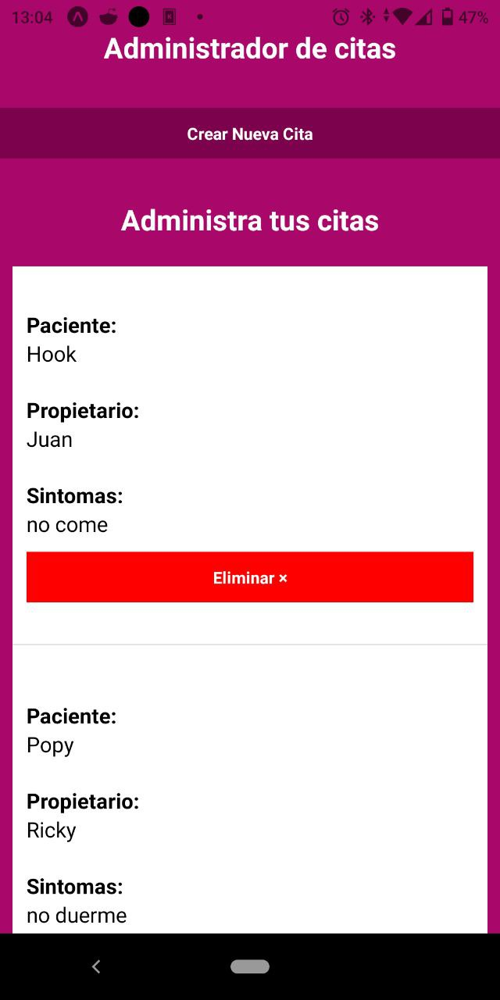

# Agenda - React Native [Expo](https://docs.expo.dev/get-started/installation/)
App para agendar citas de un consultorio veterinario.

## Componentes principales.
1. Formulario
2. Cita

## Librerias
1. DateTimePickerModal [Doc. Install](https://docs.expo.dev/versions/latest/sdk/date-time-picker/)

## Vista de la app

